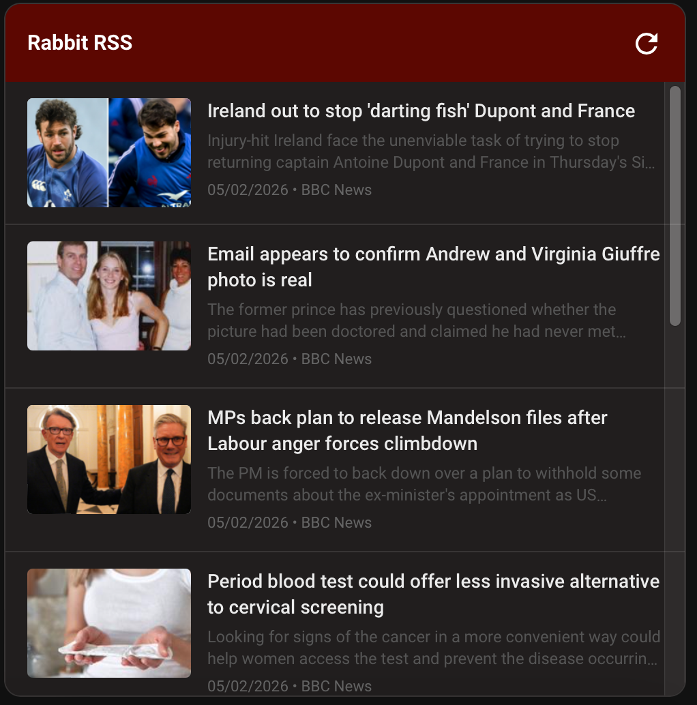

# Rabbit RSS Card
A sleek, multi-feed RSS reader for Home Assistant with thumbnails, summaries, and deep color customization.


## Previews
| Card View | Visual Editor |
| :---: | :---: |
|  |  |

---

## Features
- **Article Thumbnails**: Automatically displays images from RSS feeds alongside each article
- **Article Summaries**: Shows a preview of each article's content (first 150 characters)
- **Multi-Feed Support**: Aggregate news from multiple sources into a single, unified list
- **Visual Editor**: No YAML required! Add feeds and customize colors directly in the Home Assistant UI
- **Full Customization**: Change background colors, header colors, text styles, and summary text color to match your dashboard theme
- **Auto-Refresh**: Feeds automatically refresh at configurable intervals (default: 30 minutes)
- **Auto-Sorting**: Articles are automatically sorted by date, regardless of which feed they come from
- **Responsive Design**: Optimized for both desktop and mobile viewports with flexible layouts
- **Clean Interface**: Scrollable article list with a maximum height of 450px keeps your dashboard organized
- **Smart Text Overflow**: Titles and summaries are limited to 2 lines with ellipsis for long content

## Installation

### HACS Installation (Recommended)
1. Open HACS in your Home Assistant instance
2. Click on **Frontend**
3. Click the **three dots** in the top right corner and select **Custom repositories**
4. Add the repository URL: `https://github.com/jamesmcginnis/rabbit-rss-card`
5. Select category: **Dashboard**
6. Click **Add**
7. Find **Rabbit RSS Card** in the list and click **Download**
8. Restart Home Assistant
9. Clear your browser cache

### Manual Installation
1. Download the `rabbit-rss-card.js` file from this repository
2. Upload it to your Home Assistant instance under the `/www/` folder (e.g., `/config/www/rabbit-rss-card.js`)
3. Add the resource to your Home Assistant Dashboard:
   - Go to **Settings** > **Dashboards**
   - Click the **three dots** in the top right and select **Resources**
   - Click **Add Resource**
   - Set the URL to `/local/rabbit-rss-card.js` and the type to **JavaScript Module**
4. Refresh your browser (clear cache if necessary)

## Configuration

### Visual Configuration (Recommended)
The Rabbit RSS Card is designed to be configured through the UI:

1. Add a new card to your dashboard
2. Select **Custom: Rabbit RSS Card**
3. Use the visual editor to:
   - Add RSS feed URLs
   - Customize colors and appearance
   - Set your card title
   - Configure refresh interval (1-1440 minutes)

### YAML Configuration (Optional)
If you prefer manual YAML configuration, you can use the following structure:

```yaml
type: custom:rabbit-rss-card
title: "Tech News"
refresh_interval: 30
max_articles: 20
header_color: "#2c3e50"
header_text_color: "#ecf0f1"
bg_color: "#ffffff"
title_text_color: "#000000"
meta_text_color: "#666666"
summary_text_color: "#555555"
feeds:
  - https://www.theverge.com/rss/index.xml
  - https://techcrunch.com/feed/
```

### Configuration Options

| Option | Type | Default | Description |
|--------|------|---------|-------------|
| `title` | string | "Rabbit RSS" | Card header title |
| `refresh_interval` | number | 30 | Auto-refresh interval in minutes (1-1440) |
| `max_articles` | number | 20 | Maximum number of articles to display (1-100) |
| `header_color` | string | "#03a9f4" | Background color for the card header |
| `header_text_color` | string | "#ffffff" | Text color for the card header |
| `bg_color` | string | "#ffffff" | Background color for the card body |
| `title_text_color` | string | "#000000" | Color for article titles |
| `meta_text_color` | string | "#666666" | Color for article metadata (date & source) |
| `summary_text_color` | string | "#555555" | Color for article summaries |
| `feeds` | list | - | Array of RSS feed URLs |

**Note**: The `max_articles` option can only be configured via YAML. It is not available in the visual editor.

## How It Works

The card fetches RSS feeds using the RSS2JSON API, which converts RSS/Atom feeds into JSON format. Each article displays:
- **Thumbnail** (if available from the feed)
- **Title** (limited to 2 lines)
- **Summary** (first 150 characters of description, limited to 2 lines)
- **Metadata** (publication date and source feed name)

Articles are automatically sorted by publication date with the newest items appearing first. The card will automatically refresh feeds at the configured interval.

## RSS Feed Compatibility

The card works with any standard RSS or Atom feed. Thumbnails are extracted from:
- `thumbnail` field (common in news feeds)
- `enclosure` field (media RSS)

If a feed doesn't provide images, articles will display without thumbnails.

## Troubleshooting

### Articles not loading
- Verify your RSS feed URLs are valid and publicly accessible
- Check browser console for errors
- Try adding `?cache_boost=${Date.now()}` is automatically appended to prevent caching issues

### Thumbnails not showing
- Not all RSS feeds include image data
- Some feeds may use non-standard fields for images
- The card looks for `thumbnail` and `enclosure.link` fields

### Colors not applying
- Clear your browser cache after making changes
- Ensure color values are valid hex codes (e.g., `#ffffff`)
- Check that the card has fully loaded before expecting style changes

### Auto-refresh not working
- Verify the `refresh_interval` is set to a value between 1 and 1440 minutes
- Check browser console for any errors
- The interval timer is reset when the card configuration changes

## Credits

Developed by [James McGinnis](https://github.com/jamesmcginnis)

## License

MIT License - feel free to modify and distribute as needed.
