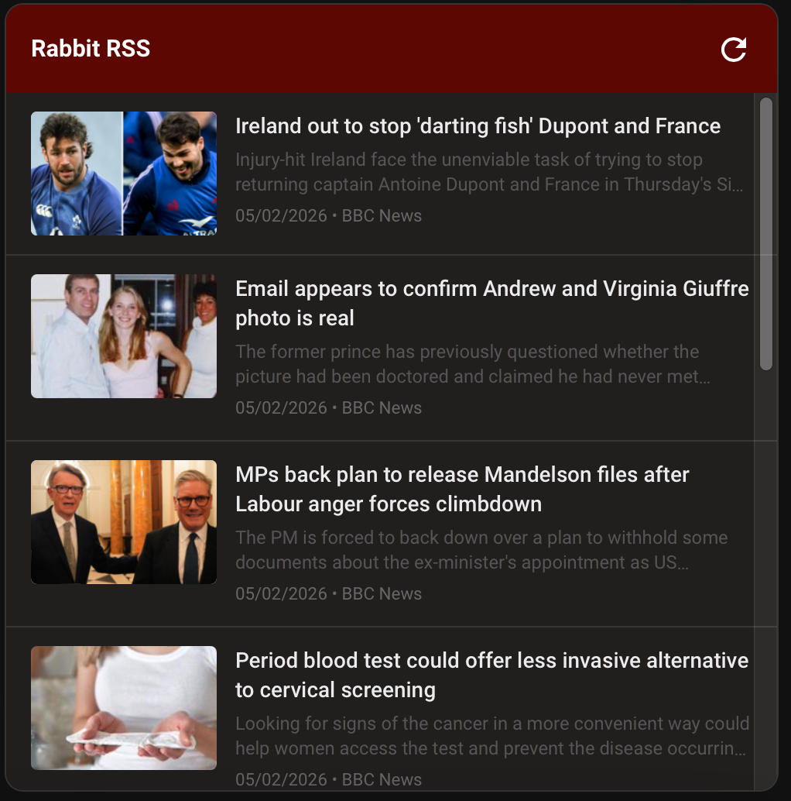
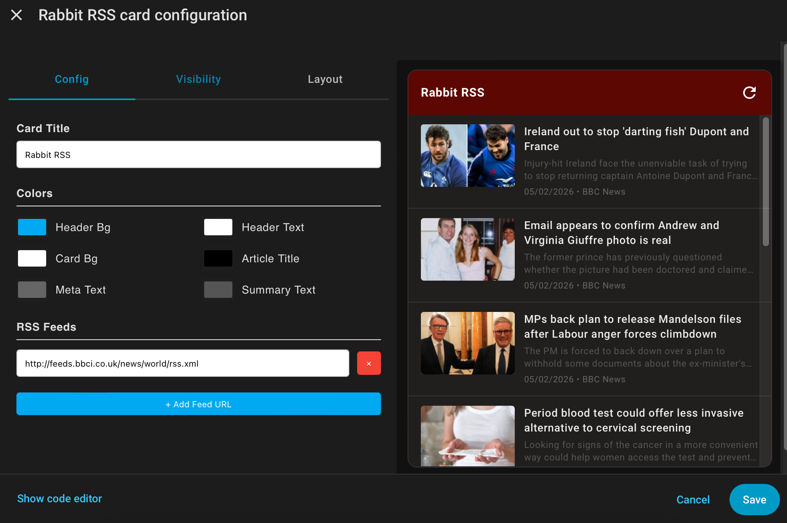

# Rabbit RSS Card
A sleek, multi-feed RSS reader for Home Assistant with thumbnails, summaries, and deep color customization.

## Key Features
🖼️ **Article Thumbnails** - Automatically displays images from RSS feeds for visual appeal
📝 **Article Summaries** - Shows preview text (first 150 characters) for each article
✨ **Visual Editor** - Configure everything through the UI, no YAML editing required
📰 **Multi-Feed Support** - Combine multiple RSS feeds into one unified view
🎨 **Full Customization** - Customize header colors, background colors, text colors, and summary colors to match your dashboard
🔄 **Auto-Refresh** - Feeds automatically refresh at configurable intervals (default: 30 minutes)
🎞️ **Continuous Auto-Scroll** - Articles scroll in a seamless loop at your chosen speed (Slow, Medium, or Fast)
📱 **Responsive Design** - Works perfectly on desktop, tablet, and mobile devices with flexible layouts
🗂️ **Auto-Sorting** - Articles automatically sorted by date across all feeds
🎯 **Clean Interface** - Scrollable list with smart text overflow keeps your dashboard organized
## Quick Start
1. Add the card to your dashboard
2. Use the visual editor to add your RSS feed URLs
3. Set your preferred refresh interval (optional)
4. Customize colors to match your theme
5. Optionally enable continuous auto-scroll in the Scrolling section
6. Done!
## Perfect For
- News aggregation from multiple sources with images
- Blog reading with previews
- Podcast feed monitoring
- YouTube channel updates with thumbnails
- Any RSS/Atom feed with or without media
- Ambient news displays and dashboard ticker views (with auto-scroll)
## Example Feeds
- **News**: New York Times, BBC, Reuters, CNN
- **Tech**: The Verge, TechCrunch, Ars Technica, Wired
- **Blogs**: Medium, WordPress blogs, personal sites
- **YouTube**: Channel RSS feeds (includes video thumbnails)
- **Podcasts**: Most podcast RSS feeds with artwork
## What You'll See
Each article displays:
- **Thumbnail image** (120x80px, when available from feed)
- **Article title** (up to 2 lines with ellipsis)
- **Summary text** (first 150 characters of description)
- **Publication date and source** (feed name)
Articles without thumbnails simply display without the image - the layout adapts automatically.
## Configuration
All configuration can be done through the visual editor, or manually via YAML if preferred.
### Available Options
- **Title**: Set your card header title
- **Refresh Interval**: Set how often feeds refresh (1-1440 minutes)
- **Auto-Scroll**: Toggle continuous looping scroll through all articles
- **Scroll Speed**: Choose from Slow 🐢, Medium 🐇, or Fast ⚡ scroll speeds (visible when auto-scroll is enabled)
- **Feeds**: Add multiple RSS feed URLs
- **Header Color**: Customize the header background
- **Header Text Color**: Customize the header text
- **Background Color**: Set the card body background
- **Title Text Color**: Color for article titles
- **Meta Text Color**: Color for dates and source names
- **Summary Text Color**: Color for article summary text
- **Maximum Articles**: Limit displayed articles (YAML only, 1-100, default: 20)
**Note**: The maximum articles setting can only be configured via YAML and is not available in the visual editor.
## Technical Notes
- Uses the rss2json API for feed parsing
- Compatible with RSS 2.0 and Atom feeds
- Extracts thumbnails from `thumbnail` or `enclosure` fields
- Strips HTML from descriptions for clean summary text
- Maximum card height: 450px (scrollable or auto-scrolling)
- Articles sorted by publication date (newest first)
- Automatic refresh based on configured interval
- Auto-scroll uses `requestAnimationFrame` for smooth, frame-rate-independent motion
- Auto-scroll creates a seamless loop by rendering articles twice and resetting position at the halfway point
- CORS-friendly implementation
- Lazy loading for thumbnail images
## Support
For issues, questions, or feature requests, please visit the [GitHub repository](https://github.com/jamesmcginnis/rabbit-rss-card).